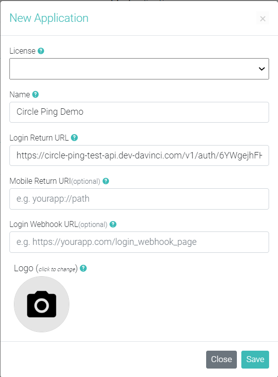
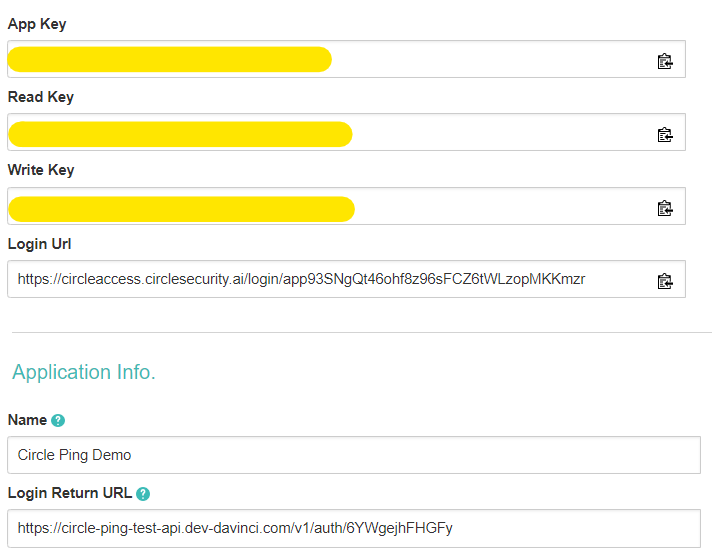

# Circle Access Connector

Author: Circle Systems

# Introduction

The Circle Access connector provides user authentication through the Circle Access Service and provides the user session information,
as well as the hash of emails, that can be used by other connectors for user control and validation.

# Setup

## Before setting up the connector

Please visit https://license.circlesecurity.ai/ to register the application.
Click on the **[Add New]** and fill in the fields. Here we used `Circle Ping Demo` as example Name, you also need to select your `License`:

To get the **Login Return URL**, follow the steps:

- click on Connections (**left menu**) on the Ping Identity page.
- click on the [**New Connection**] button and add the **Circle Access** Connector
- click on the conector and the Redirect URL will be shown

# Using the connector in a flow

After adding the connector to the flow, some fields need to be configured. 
Click on the connector to configure these fields:

We have to go back to https://license.circlesecurity.ai/ to get the field values (click on the App **info icon** - the first icon)

## Use cases

A common use case is to enable credential-free authentication for your current end users.
This allows your end users to access your Web application and/or server from any public (or private) computer and browser while eliminating any possibility of the user's credentials being stolen or hijacked.  
The user authenticates by scanning a QR code on their smartphone, with no need to type in any information.

Another popular use case is to enable easy and fast log-in for users that are already registered.
In this case, the user has registered their email with you, so you just need to get the hash of your current user and compare it with the hashes returned from the Circle Access connector.

For new users, Circle Access allows rapid and secure sign-ups, as the hash of the email is always available after the QrCode scan. This means that you can just request the email once and use the login scan to confirm it, without the need to send information or requests to the user's email. Once confirmed, you just save the information and let the user in.

This method is secure on any public (or private) computer and browser because - even if the computer is compromised - the only information that is exposed is the user email, while the hashes and session information are delivered securely and directly to your connector.

# Capabilities

### Authentication (initializeAuthorizationRequest)

Authentication using Circle Access

#### App Key `textField`

App Key

#### Read Key `textField`

Read Key

#### Write Key `textField`

Write key

#### Login Url `textField`

The URL of your Circle Access login

---

