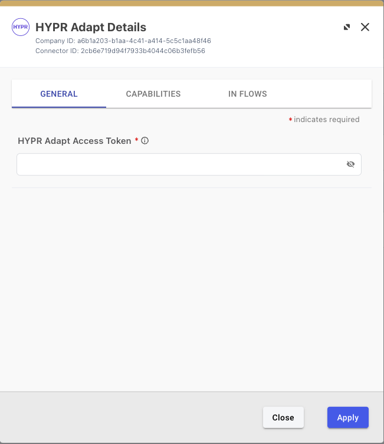
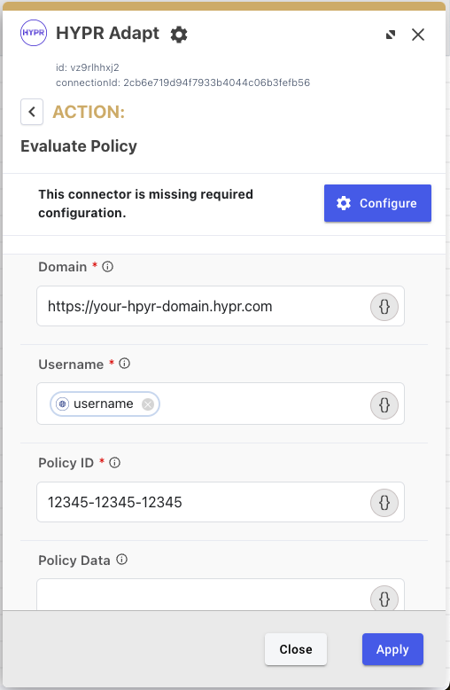

# HYPR Adapt Connector

Author: 
Sean Dyon

# Introduction

The HYPR Adapt connector lets you use HYPR Adapt to improve identity security in your PingOne DaVinci flow.

HYPR Adapt dynamically assesses potential identity threats and enforces adaptive security controls so you can easily and effectively manage identity-related risks.
The solution’s powerful risk engine analyzes risk signals and telemetry from numerous sources, including user behavior analytics and contextual information from mobile, endpoint and browser signals.
Results used to enforce step-up authentication, prompt re-verification or deny access altogether
Information can be shared with SIEM, SOAR and other enterprise systems for additional enforcement or reporting actions.
Detailed insight into individual risks enables your organization to deliver a personalized user flow with Ping DaVinci that is optimized to reduce friction while maintaining stringent security measures.

You can use the HYPR Adapt connector to:
Evaluate a policy with HYPR’s data and signals
Evaluate a policy with data from DaVinci Connectors


# Setup

Before adding HYPR Adapt Connector in DaVinci, ensure that you have a policy created in your HYPR tenant.

## Resources

Please refer to HYPR documentation [here](https://docs.hypr.com/hyprcloud/docs/cc-std-hypr-adapt), or connect with your Solution Engineer to complete these steps.

## Requirements

To use the connector, you'll need:

HYPR Tenant
Access Token from your HYPR Tenant
Policy created in HYPR

## Setting up the connector

In DaVinci, add a HYPR Adapt connection. For help, see [Adding a connector](https://docs.pingidentity.com/r/en-us/davinci/davinci_adding_a_connection). 

### Connector settings

To configure the connector, provide your Access Token to the connector in the general settings.



# Using the connector in a flow

Add the connector to an existing flow. Once the connector is added, select Evaluate Policy and provide the following information. This will enable the policy you created in your HYPR Tenant to be evaluated at the step you defined for your DaVinci Flow.

Domain: This is your HYPR tenant.
Username: This will be the username from a prior connector, such as an html template.
Policy ID: This is the policy you created in HYPR.
Policy Data: Provide any data here that you would like to evaluate against as part of the policy evaluation. This can include data from other connectors.



You can use the connector in a variety of use cases, such as:
Evaluate a policy with HYPR’s data and signals
Evaluate a policy with data from DaVinci Connectors

For example, if you possess an endpoint product equipped with a DaVinci connector and aspire to integrate its intelligence into your web workflow, look no further than the HYPR Adapt connector. This connector seamlessly merges your web identity with the unique identifier of your endpoint product governed by a tailored policy.

Combining HYPR’s data and signals associated with the user’s identity and data from DaVinci’s connector ecosystem with policy as code enables administrators to maximize value and simplify flows they create.

# Capabilities

## Evaluate Policy

This capability evaluates HYPR policy which returns allowed or denied responses.

Input Schema:

```
 "default": {
    "type": "object",
    "properties": {
      "properties": {
        "type": "object",
        "properties": {
          "domain": {
            "type": "string",
            "description": "HYPR Domain"
          },
          "username": {
            "type": "string",
            "description": "Username of end user"
          },
          "policyId": {
            "type": "string",
            "description": "HYPR Policy ID"
          },
          "policyData": {
            "type": "string",
            "description": "HYPR Policy Data"
          }
        },
        "required": [
          "accessToken",
          "domain",
          "policyId"
        ]
      }
    },
    "example": {
      "properties": {
        "domain": "https://domain.gethypr.com",
        "username": "test",
        "policyId": "xxxxxxxx-xxxx-xxxx-xxxx-xxxxxxxxxxxx",
        "policyData": "{\"test\" : \"test\"}"
      }
    }
  }
}
```

Output Schema:

```
{
  "output": {
    "type": "object",
    "properties": {
      "rawResponse": {
        "type": "object"
      },
      "statusCode": {
        "type": "number"
      },
      "headers": {
        "type": "object"
      },
      "result": {
        "type": "object"
      },
      "allowed": {
        "type": "boolean"
      },
      "allowedAuthenticators": {
        "type": "array"
      },
      "message": {
        "type": "string"
      }
    }
  }
}
```


## Evaluate Dynamic Policy

This capability evaluates and sets HYPR policies which returns allowed or denied responses.

This capability does not have an input schema as it requires a properly formatted JSON Body as part of its configuration.

Output Schema: 

```
{
  "output": {
    "type": "object",
    "properties": {
      "rawResponse": {
        "type": "object"
      },
      "statusCode": {
        "type": "number"
      },
      "headers": {
        "type": "object"
      },
      "result": {
        "type": "object"
      },
      "allowed": {
        "type": "boolean"
      },
      "allowedAuthenticators": {
        "type": "array"
      },
      "eventsConsidered": {
        "type": "object"
      },
      "message": {
        "type": "string"
      }
    }
  }
}
```

