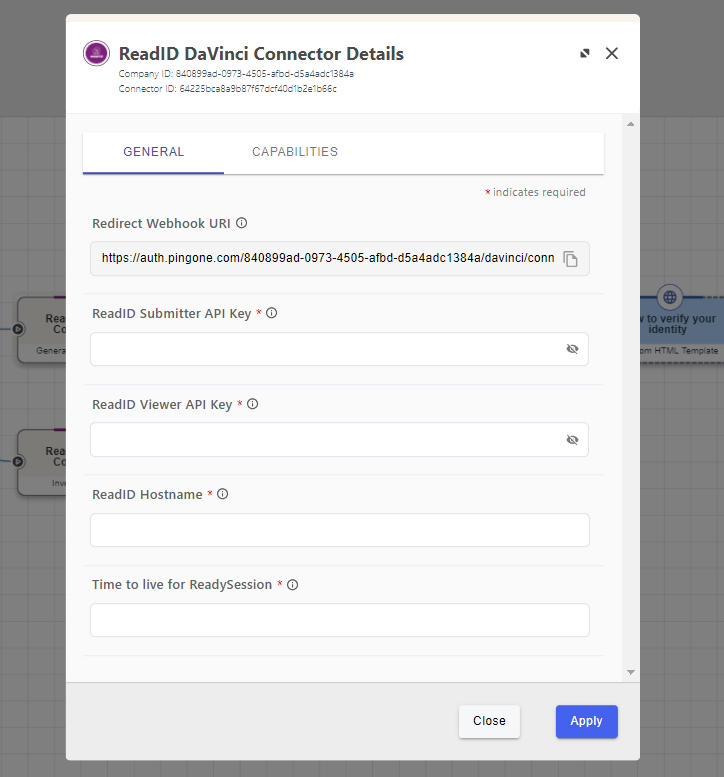
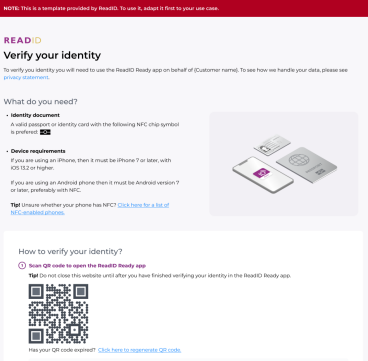

# ReadID by Inverid Connector

Author: Inverid

# Introduction

The ReadID DaVinci Connector enables you to verify NFC chipped passports and identity documents. You can use the ReadID DaVinci Connector in onboarding, account recovery and/or step-up authentication flows. ReadID will return detailed results on document data integrity, authenticity and anti-cloning checks, alongside official data embedded in the chip, such as name, date of birth, and document number. It will also provide the high-resolution face image direct from the chip that is a high-quality reference for subsequent face matching processes.

ReadID comprises a SaaS backend for verification operations and mobile application to interface with users' document chips through NFC.
Reading NFC chips requires native access to APIs on Android and iOS. The Ping Davinci connector uses the ready-to-use ReadID Ready app from Inverid, enabling quicker integration than using mobile SDKs. You do not need to have your own native app to get started.

iOS users can benefit from ReadID Ready App Clips, which eliminate the need for users to install from the App Store and create a seamless user experience.

For information, see the following Inverid documentation:
* Trusted-identity-verification - what are NFC chips and how do they work
* ReadID Ready - overview and animation/screen recording on ReadID Ready
* Privacy Policy for ReadID Ready
* ReadID Ready FAQ - for users using ReadID Ready
* Inverid certifications - overview of Inverid certification

# Setup
## REQUIREMENTS
To use the ReadID DaVinci Connector, you'll need:
* A PingOne DaVinci environment licenced from Ping Identity
* An Inverid ReadID license (sandbox)
* Your ReadID application credentials (Submitter and Viewer keys), and hostname (all via Inverid) • To share your webhook URI from the ReadID DaVinci Connector with Inverid 

## TALK TO AN EXPERT
Sandbox users will need to contact Inverid to obtain sandbox credentials:
https://www.inverid.com/ping-identity-davinci-connector

## CONFIGURING THE READID DAVINCI CONNECTOR
Add the ReadID DaVinci Connector in PingOne DaVinci via the Connectors tab, then configure it as follows:

### READID DAVINCI CONNECTOR CONFIGURATION

From the ReadID DaVinci Connector Details you will find the required information for the Webhook URI,  ReadID Submitter API Key, ReadID Viewer API Key, ReadID Hostname and Time to live for ReadySession.

#### For ReadID Davinci Sandbox
Find the Redirect Webhook URI and copy the URI. You will need to share this to your Inverid onboarding  contact so the ReadID sandbox can be configured to retrieve finished sessions results from the ReadID server.

Example: https://auth.pingone.com/231478912347891247891247891247

#### ReadID API Key
Inverid will provide API Keys for Submitter and Viewer. You will need to add these keys in the ReadID DaVinci  Connector Details configuration page 

* Add ReadID Submitter API Key:
 Example: 123-456-789
* Add ReadID Viewer API Key:
 Example: 123-456-789
* Add ReadID Hostname:
 Example: readid.davinci.connector.com
* Time to live for ReadySession:
 Set between 30 and 72000

# Using ReadID DaVinci Connector
Inverid has built an example Davinci web flow that simply initiates a session and returns the results.

On request Inverid can supply a sample ReadID Davinci Connector, please contact your Inverid onboarding contact.

Example of sample flow ReadID DaVinci Connector:

## START THE FLOW

Instructions are needed for a user to go through the ReadID flow to make a successful flow. Example of instructions that could be used:

Example desktop instructions:

Example mobile insturctions:

## Start the ReadID session
Follow the instructions in ReadID Ready after scanning the QR code or selecting the Activation link. 

# SESSION RESULT
Wait for ReadID to send the result of a document verification check to the ReadID DaVinci Connector webhook URI.

Example of results after a successful ReadID sessions and a successful retrieve for the information by the  ReadID DaVinci Connector (Result Json and Face image). 

Face image from the document NFC Chip:

# READID DAVINCI CONNECTOR SCHEMA
From the ReadID DaVinci Connector result/fields can be used and checked within the flow below we explain  what fields are available to use (EXTERNAL) and what fields not to use (INTERNAL) 

## API Access levels
All APIs are marked with an annotation for the output schema . This label defines the development status and/or access level. Some APIs are available for technical reasons but are considered internal and for ReadID use only. The same information is also available in this API documentation. but the labels in the actual schema are always leading.

Output Schema Result ReadID DaVinci Connector:

 EXTERNAL For features and/or API parts that can be used by customers using the ReadID Davinci Connector.
 
 INTERNAL For features and/or API parts that are for internal, i.e. ReadID, use only. As such these features may change between ReadID versions without notification.
 
 BETA For features and/or API parts which are still in development. These features may change between ReadID versions without notification.

| Output              | Info | Label |
| :---------------- | :------: | ----: |
| rawResponse |   The rawResponse of the output | INTERNAL |
| statusCode |   Status code   | INTERNAL |
| header    |  Header Request   | INTERNAL |
| app |  Application related data   | INTERNAL - This field is deprecated as of M109 |
| chip |  Chip related information sent by the application  | EXTERNAL - This field is deprecated as of M109 |
| clientId | Unique identifier for client. This is an opaque identifier that identifies a specific client application. On Android the package name of the application is used  | INTERNAL |
| consolidatedIdentityData |  Identity data consolidated from different sources applicable for this session   | EXTERNAL |
| creationDate |  Date when this session was created. Timestamp on the moment when the session was inserted into the database   | EXTERNAL |
| deviceId |  Unique identifier for a specific device. This value is asserted by the SDK and is on a reasonable effort basis. This value can be used to link multiple ReadID sessions to the same device. - This field is deprecated as of M104  | EXTERNAL |
| deviceInfo |  Device related data - This field is deprecated as of M104   | INTERNAL |
| documentContent |  Interpreted data captured from the document chip using NFC technology  | EXTERNAL |
| expiryDate |  Date when this session will be purged from the database. Once this point in time has been passed, the ReadID session will be permanently deleted.   | EXTERNAL |
| iProovSession |  Face recognition data   | INTERNAL |
| lib |  Library related data  | INTERNAL - This field is deprecated as of M109 |
| nfcSession |  Raw data captured from the contactless chip  | INTERNAL |
| vizImages |  Images from the Visual Inspection Zone (VIZ)   | INTERNAL |

 

