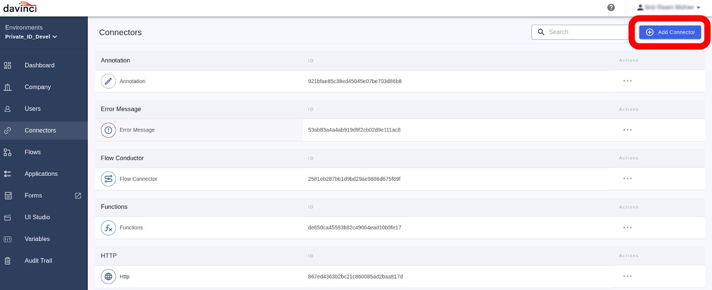
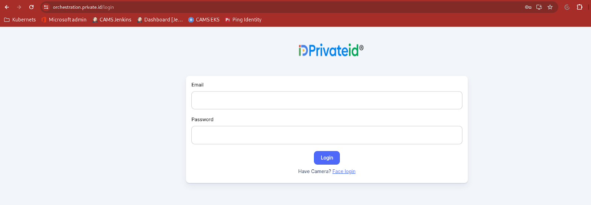
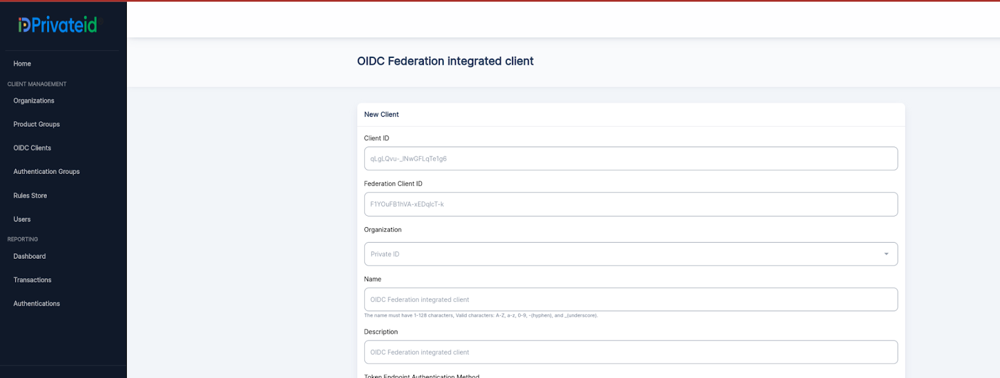
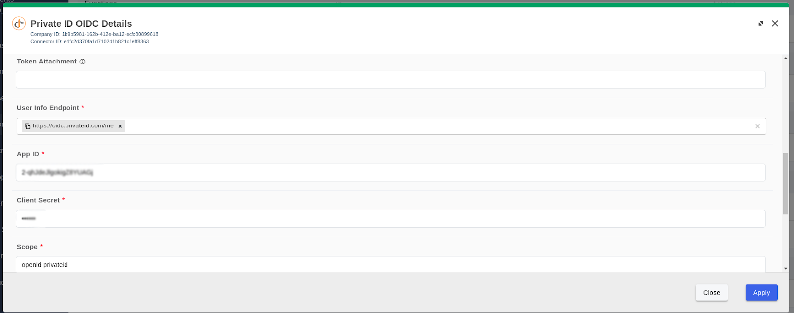

# Private Identity® Credential Service Provider “PrivateID® Connector”

Author: Srie Raam Mohan, Private ID

# Overview
Private Identity’s passwordless, Kantara-certified compliant NIST 800-63 IAL2 Remote Digital Onboarding, NIST 800-3 AAL2 Encrypted Biometric Authenticator, and MFA “PrivateID® Connector” provides the strongest identity security solutions to support global businesses, nonprofit, education, US state/local/Federal Governments, and allied governments. 

This solution eliminates the friction of passwords and allows seamless integration into enterprise and US Government systems including OS, VPN and SSO solutions.

Below, we describe the procedure to configure the Private Identity Credential Service Provider’s “PrivateID Connector” to support Kantara-certified NIST 800-63 secure digital onboarding and passwordless authentication using PingFederate or PingOne DaVinci. 

This allows users to onboard using up to Identity Assurance Level 2 (IAL2), the most secure digital onboarding available worldwide, and sign-in using up to Authentication Assurance Level 2 (AAL2), the most secure 1:N encrypted, privacy-preserving facial biometric log in available worldwide, for applications that use PingFederate. 

# Prerequisites
You will need the following resources and privileges to complete this integration:

* Private Identity software or a tenant URL. Your organization should have Private Identity software installed on your private or public compute infrastructure, or subscribed to use a Private Identity tenant. Contact us (sales@privateid.com) to enroll your organization.
* After account creation access your:
  * Login Credentials: These are essential for authentication purposes.
  * Orchestration Hub: Administration Login
  * OIDC Client Details: These details are required for OpenID Connect (OIDC) configuration.
  * Product Group ID (productGroupId): This identifier facilitates organization and management within the dashboard.
  * Terraform installation scripts for onsite installation (if required). 
* PingFederate or PingOne DaVinci with the Private Identity Connector. 
Developers must possess a valid PingOne DaVinci account to establish the integration successfully.

## Key Features: 

### PrivateID 1:N Biometric Face Recognition w/ Age Estimation - 50ms processing. Perform facial recognition and computations on encrypted images without decryption. Preserves user privacy and limits corporate risk from data breaches as no biometric is ever captured, processed or stored. Exempt from global privacy law obligations like GDPR, BIPA, CCPA and HIPAA by only processing anonymized data and follows IEEE 2410 standards.
1. Can be combined with companies  existing FIDO2® Passkey to provide the ultimate 2FA FIDO 2 authenticator that provides reduction in OpEx costs associated with account recovery, increases fraud prevention, as well as streamlines user experience. Configurations include…
2. Face (1FA)
3. Face + FIDO2 Passkey (Strong 2FA)
4. Face + PIN (2FA)
5. Face + Barcode or MRZ  (2FA)
6. Face + Credit or Debit Card (FIDO2 Passkey on Credit Card)
7. Any combination of above

### PrivateID Face Recognition + Photo ID Verification (customer identification assurance) - Complete white labeled and customizable identity proofing for customers and employees with on-device government Photo ID extraction and FHE-encrypted photo to selfie matching with liveness anti-spoofing detection.
1. On Device - Capture Face via selfie
2. On Device - ScanID (Doc Capture) 
3. On Device - Document data extraction
4. On Device - Match Selfie to ID portrait
5. On Device - Selfie Liveness / Anti-Spoofing
6. On Server - Forensic document authentication
7. On Server - DMV System of Record check
8. On Server - Additional 3rd party data validation checks (credit bureau, mobile carrier, open sanctions, PEP’s/sanctions, adverse media, email, address, etc.)

### NIST 800-63 Identity Assurance Level 2 / AAL2 Workflow - To achieve (up to) NIST 800-63a Identity Assurance Level 2 (IAL 2), companies may incorporate the following solutions in the Private ID Identity Orchestration Layer. Additional workflows may also be configured.
1. Forensic document verification
2. DMV System of Record Check 
3. Credit Bureau - SNN4, DOB, Address, First & Last Name
4. Mobile Carrier - Phone validation through carrier 
5. Email verification
6. Open Sanctions - OFAC, Criminal Watchlist, etc

### Verified Credential (VCs) with web wallet or mobile wallet - Organizations may use a combination of mobile and web wallets to create, access and share secure Verifiable Credentials. Users can access and manage the sharing of their secure verified credentials from any browser with Face, or Face + FIDO2 Passkey. 
PrivateID Verified Credentials provide secure management and sharing of customer and workforce data for fast checkout and sign up. 

### PrivateID Identity Orchestration Layer - Customizable identity hub hosted in companies infrastructure to set endless workflows, rules and waterfalls for KYC/AML/CFT, customer remote digital onboarding (NIST 800-63A IAL 2) and authentication workflows with PrivateID 1:N facial biometrics combined with (your existing) FIDO2® Passkeys (AAL2). 

# Setup

To integrate the PrivateID connector with PingOne DaVinci, follow these steps. 
For additional assistance, see the Ping Identity documentation Adding a connector.

## Start with PingOne DaVinci
1. Log in to your PingOne DaVinci account. Once logged in, navigate to the Connectors page within the DaVinci platform.Click on the "Add Connector" button to initiate the process of adding a new connector

2. Look for the PrivateID Connector option in the list of available connectors. Click + to add the connector.

3. Follow the on-screen instructions to configure the PrivateID Connector according to your requirements. Enter a name for the new connector, such as PrivateID OIDC, and click Create.

4. Identify the connector created for the integration with PrivateID from the list of connectors. Click on the "Edit" option from the actions menu associated with the created connector.

5. Once in the edit mode, locate the Redirect URL field. Copy the Redirect URL provided. This URL will be used in the Orchestration module during the setup process. Save the Redirect URL for later use in the Orchestration module.

## Orchestration Hub

Follow these instructions to configure the integration in the Orchestration Hub:

1. Use the provided credentials to log in to the Orchestration module.

2. Once logged in, navigate to the OIDC Clients section within the Orchestration module. Click on the Create Client button to initiate the process of creating a new OIDC client.

3. Choose the appropriate organization from the available list for which the integration is being configured.

4. Fill in the necessary details such as Name, Description, and select "client_secret_basic" as the token endpoint authentication method. Paste the Redirect URI obtained from Step 5 of the DaVinci setup into the respective field. After filling in the required fields, click on the "Save" button to save the configuration.

5. Once the client is created, navigate to the details page. Note down the client_id and client_secret provided for later use in the integration process.

## PingOne Davinci
* Access the configuration settings of the connector previously created for the integration.
* Locate the fields for Client ID and Client Secret within the connector configuration settings.
* After pasting the Client ID and Client Secret, ensure to save the changes made to the connector configuration.
* With all other fields populated with default values, your setup will be complete.

By following these steps, you'll successfully integrate the Client ID and Client Secret obtained from the Orchestration module into PingOne DaVinci. This completes the setup process, and your integration should now be configured to communicate seamlessly between DaVinci and the Orchestration module. If you encounter any difficulties, refer to the documentation or contact the support team for assistance.

Connector settings
To configure the connector settings for seamless integration, ensure the following parameters are set accordingly:

Provider Name: Custom Name describing the name of the provider
Auth Type: OpenId
Redirect URL: Davinci Redirect URL on which the callback is received
User Info Endpoint: https://oidc.privateid.com/me
App ID: Client ID created in orchestration portal
Client Secret: Client Secret created in orchestration portal
Scope: openid privateid

# Using the connector in a flow

After successfully creating the connector, you can proceed to create flows in PingOne DaVinci to execute tasks leveraging the connector's capabilities. For more information on how to create flows, please refer to the documentation on Davinci Flows

Here are the mandatory parameters required during flow creation to enable the PrivateID connector to perform tasks:

* productGroupId: This parameter is received as part of the Private Identity onboarding process in the Orchestration module. It helps identify the specific product group associated with the task.

* actionFlow: This parameter determines the action to be performed by the PrivateID connector. The following actions are supported:

* register: 	Redirects the UI to perform Remote Digital Onboarding up to Identity Assurance Level 2 (IAL2)  (“registration”).
* login: 	Redirects  the UI to perform encrypted biometric Authentication Assurance Level 2 (AAL2) face authentication with FIDO2 Passkey.
* forget_me: 	Redirects the UI to remove the account.

# Use Cases:

The PrivateID connector can be utilized in various use cases, including but not limited to:

## Use Case: “Register” - Remote Digital Onboarding (IAL2)

In the register use case flow, the PrivateID OIDC returns a UUID upon successful registration/authentication. This flow can be integrated with the Userpool associated with DaVinci. Here's how the flow operates:

* Flow Trigger: Upon triggering the flow, connect with the User Policy > Create Users capabilities.

* User Creation: Utilize the UUID returned from the userinfo endpoint to create a user within the Userpool associated with PingOne DaVinci.

## Use Case: login - Authentication Assurance Level 2 (AAL2)

In the “login” use case flow, the PrivateID OIDC returns a UUID upon successful authentication. This flow can be integrated with the Userpool associated with DaVinci. Here's how the flow operates:

* Flow Trigger: Upon triggering the flow, connect with the User Policy > Get Users capabilities.
* User Verification: Use the UUID returned from the userinfo endpoint to check whether the user already exists in the Userpool associated with DaVinci.
* Registration Action: If the user is not registered, trigger a registration actionFlow to initiate the registration process

## Use Case: forget_me - Fulfills the required GDPR “forget_me” functionality

In the “forget_me” use case flow, the PrivateID Connector performs a deletion from the server upon successful authentication. OIDC will throw in-built OIDC error and error description once the flow is complete. Here's how the flow operates:

* Flow Trigger: Upon triggering the flow, connect with the User Policy > Get Users capabilities.
* Custom UI Response: OIDC returns “Account Deleted” response on successful deletion.
